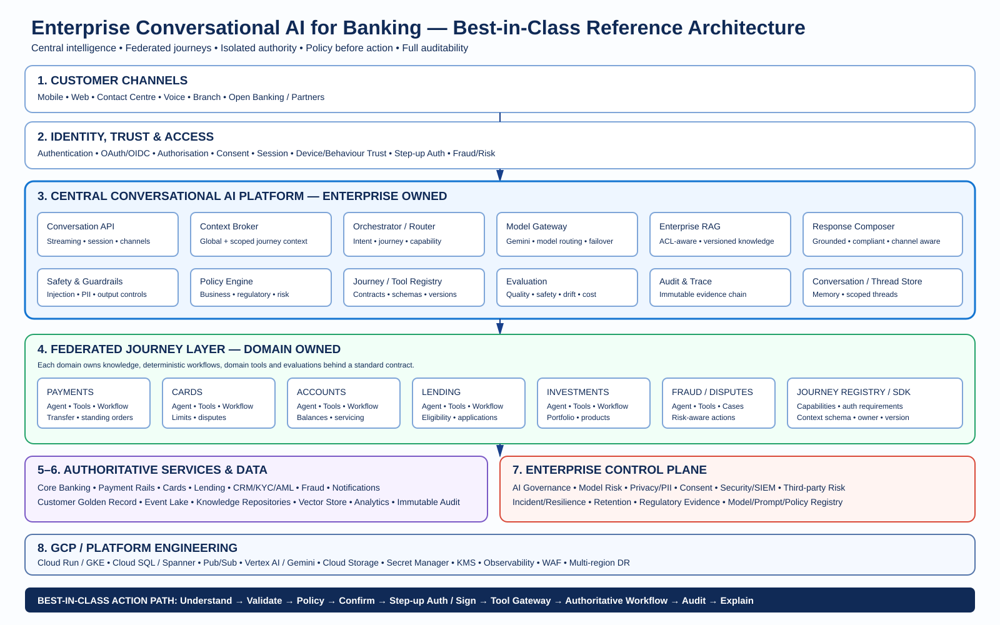

# Enterprise Conversational AI Reference Architecture

A GitHub-ready reference implementation for a central conversational AI platform with federated domain journeys. This repository is intentionally provider-agnostic and uses dummy banking data so teams can run it locally, inspect the end-to-end control flow, and adapt it to their own organisation.



**Architecture at a glance:** Centralise intelligence and controls; federate domain capability; keep authoritative systems and transaction authority outside the LLM.

## Status

Reference implementation / starter kit. It is **not** production banking software and must not be connected to real customer accounts, payment rails, credentials, or regulated decisioning without a full security, architecture, privacy, model-risk, resilience, and compliance review.

## What is demonstrated

- Central Conversation API and orchestrator
- Global conversation context with scoped journey threads
- Journey registry / capability catalogue
- Federated Accounts, Payments, Cards and Lending journeys
- Tool Gateway boundary between AI and authoritative bank services
- Deterministic policy and confirmation flow for financial actions
- Mock authentication and step-up authentication boundary
- Model Gateway with local mock mode and optional Gemini integration
- Lightweight knowledge/RAG component
- Guardrails and response composition
- Structured audit events and trace IDs
- Dummy core-banking service
- Browser demo UI
- Docker / Cloud Run deployment starter
- Tests and an enterprise implementation playbook

## Quick start

```bash
python -m venv .venv
source .venv/bin/activate
pip install -r requirements.txt
uvicorn app.main:app --reload --port 8080
```

Open `http://localhost:8080`.

Try:

- `What is my balance?`
- `Show my cards`
- `What lending options do I have?`
- `Move £500 to my savings`

A financial transfer is intentionally split into proposal -> confirmation -> execution. The model never receives credentials and never directly calls the dummy bank.

## Gemini

Set `GEMINI_API_KEY` to enable Gemini through the model gateway. If the key is absent, the deterministic mock model is used so the application remains runnable without external credentials.

```bash
export GEMINI_API_KEY="..."
export GEMINI_MODEL="gemini-2.5-flash"
uvicorn app.main:app --reload --port 8080
```

Keep API keys out of source control. For GCP, use Secret Manager and workload identity / service accounts rather than hard-coded credentials.

## Architecture principle

> **Centralise intelligence; federate capability; isolate authority.**

The central platform owns conversation management, model access, safety, context brokering, routing, policy controls, observability and shared infrastructure. Domain teams own journey knowledge, business rules, tools and deterministic workflows.

```text
Customer Channels
       |
       v
Conversation API
       |
       +--> Identity / Session / Consent
       |
       v
Central Conversation Orchestrator
       |
       +--> Context Broker
       +--> Intent / Journey Router
       +--> Model Gateway
       +--> RAG / Knowledge
       +--> Guardrails
       +--> Policy Engine
       +--> Journey Registry
       |
       +-------------------------------+
       |                               |
       v                               v
Payments Journey                 Accounts Journey
Cards Journey                    Lending Journey
Fraud / Disputes                 Other Domains
       |                               |
       +----------- Tool Gateway ------+
                       |
                       v
             Authoritative Bank APIs
                       |
                       +--> Core Banking
                       +--> Payments
                       +--> Cards
                       +--> CRM / KYC
                       +--> Risk / Fraud

Cross-cutting: Audit | Security | Model Risk | Privacy | Observability | Resilience
```

## Best-in-class implementation

The starter code demonstrates the shape of the architecture. A production-grade implementation should evolve it into a **platform product**, not simply a larger chatbot.

### 1. Separate the four authorities

| Authority | Owns | Must not be delegated to the LLM |
|---|---|---|
| **Identity authority** | Customer identity, session, entitlements, device trust | Authentication, credentials, OTP/PIN handling |
| **Business authority** | Account/card/payment/product state | Source-of-truth balances, transaction state |
| **Risk/policy authority** | Fraud, AML, limits, eligibility, regulatory rules | Final policy or risk decision |
| **AI authority** | Understanding, planning, retrieval, explanation | Permission to execute money movement |

This separation is the most important production design rule.

### 2. Make the conversation global, but execution scoped

Use one `conversation_id` across the customer experience, while every domain receives a scoped `journey_thread_id`.

```text
conversation_id: C-123
│
├── accounts-thread: A-17
├── payments-thread: P-82
├── cards-thread:    CR-44
└── lending-thread:  L-09
```

The context broker should expose only the minimum context a journey is entitled to see. Sensitive context should be capability- and policy-gated, not automatically copied between agents.

### 3. Treat journeys as products with contracts

Every federated journey should register:

- journey ID and version
- owner/team
- supported intents and capabilities
- context schema
- tools and typed input/output schemas
- required authentication level
- transaction risk classification
- policy requirements
- allowed data domains
- escalation/human-handoff rules
- SLOs and operational contacts
- evaluation suite and release gates

A domain team should be able to ship a journey without modifying the central orchestrator.

### 4. Put a Tool Gateway between AI and the bank

Never expose core banking APIs directly to an LLM. The Tool Gateway should enforce:

1. authenticated customer/service identity
2. authorisation and entitlement checks
3. consent and purpose checks
4. strict JSON/schema validation
5. policy evaluation
6. fraud/risk checks
7. idempotency and replay protection
8. rate and velocity limits
9. transaction signing / step-up requirements
10. immutable audit events

The gateway should also provide a stable contract so the underlying banking systems can evolve independently.

### 5. Use deterministic workflows for state-changing journeys

For payments, card controls, lending applications, disputes and similar operations, the LLM should produce a **proposal**, not execute the workflow.

```text
Natural language
      ↓
Intent + entities
      ↓
Journey selection
      ↓
Deterministic validation
      ↓
Policy / risk decision
      ↓
Customer confirmation
      ↓
Step-up authentication / transaction signing
      ↓
Deterministic workflow
      ↓
Authoritative bank service
      ↓
Audit + event
      ↓
LLM explains authoritative result
```

Use state machines/workflow engines for long-running operations, retries, compensation, timeout handling and human intervention.

### 6. Build a real Model Gateway

The model gateway should hide model-provider details from journeys and provide:

- model routing by task and risk tier
- regional/data-residency routing
- provider failover
- model version pinning
- token/cost budgets
- latency SLOs
- safety configuration
- prompt/model metadata
- offline evaluation gates
- provider health monitoring
- third-party risk and exit strategy

This prevents the domain layer becoming coupled to one model vendor.

### 7. Make RAG permission-aware

A production knowledge platform should have ingestion, classification, ownership, versioning and access-control metadata. Retrieval should apply customer/employee entitlement filters **before** content is supplied to the model.

Recommended flow:

```text
Source documents → classify → approve → chunk → embed → index
                                             ↓
User/journey identity → policy → ACL/metadata filter → retrieve → ground response
```

Do not treat a vector database as the system of record. Product, policy and customer data should retain authoritative owners.

### 8. Build an AI evidence chain

For every material interaction, be able to reconstruct:

```text
conversation_id
  → journey/version
  → prompt/version
  → model/provider/version
  → retrieved knowledge/version
  → policy decision/version
  → tool/version
  → authentication event
  → transaction/event ID
  → final customer response
```

This should feed an immutable regulatory evidence store and incident investigation process. Avoid logging secrets, credentials or unnecessary raw PII.

### 9. Production GCP reference stack

A strong GCP implementation can map the logical architecture to managed services approximately as follows:

| Capability | GCP starting point |
|---|---|
| API / edge | API Gateway or Apigee + Cloud Armor |
| Conversational services | Cloud Run; GKE where workload/control requirements justify it |
| AI / model platform | Vertex AI / Gemini behind Model Gateway |
| Durable transactional state | Cloud SQL or Spanner, selected by consistency/scale requirements |
| Event backbone | Pub/Sub |
| Documents / evidence | Cloud Storage |
| Secrets | Secret Manager |
| Keys / signing | Cloud KMS; HSM-backed controls where required |
| Analytics / regulatory reporting | BigQuery + governed data pipelines |
| Monitoring | Cloud Logging, Cloud Monitoring, Trace/OpenTelemetry |
| Security | IAM, VPC, private connectivity, WAF, SIEM integration |
| CI/CD | Cloud Build / GitHub Actions + Artifact Registry |

Use multi-zone deployment by default and design regional failover, degraded modes and recovery objectives explicitly for important customer journeys.

### 10. Central vs federated operating model

**Central platform team owns:**

- Conversation API and runtime
- Model Gateway
- shared context services
- safety and guardrails
- enterprise RAG platform
- policy enforcement framework
- Tool Gateway
- IAM integration standards
- audit/evidence platform
- observability and SRE
- AI governance and model-risk controls
- common SDKs and developer portal
- platform SLOs and incident management

**Domain teams own:**

- customer/business journey outcomes
- domain prompts and instructions
- domain knowledge
- tools and API adapters
- deterministic workflows
- domain policies/business rules
- journey-specific evaluations
- human escalation
- domain SLOs and operational readiness

**Joint ownership:**

- threat modelling
- model evaluations
- release approval
- data classification
- regulatory impact assessment
- customer experience metrics

### 11. Release journeys like production software

Every journey release should pass automated gates for:

- functional tests
- tool-contract tests
- policy tests
- prompt-injection tests
- sensitive-data leakage tests
- hallucination/grounding tests
- adversarial/abuse tests
- latency and cost tests
- regression evaluations
- resilience/failure tests
- human-handoff tests

Prompts, models, policies, tools and journey contracts should all be versioned artifacts.

### 12. Design for graceful degradation

AI must not become the bank's single point of failure.

```text
Normal:        Conversational AI → Journey → Bank
AI degraded:   Intent shortcuts / traditional journey → Bank
Model outage:  Search / deterministic FAQs / assisted service
Risk outage:   Safe fail-closed for protected actions
Bank outage:   Explain unavailable service; do not fabricate state
```

For financial actions, fail closed rather than guessing or retrying blindly.

## Recommended enterprise delivery roadmap

### Phase 0 — Platform and risk baseline

Define target architecture, ownership, data classification, threat model, regulatory scope, model-risk classification, SLOs, audit requirements and initial journeys.

### Phase 1 — Information assistant

Launch low-risk authenticated information journeys. Establish the central runtime, model gateway, RAG, observability and evaluation framework.

### Phase 2 — Assisted journeys

Introduce domain-owned journeys that prepare forms, explain products, retrieve information and guide customers without autonomous financial execution.

### Phase 3 — Low-risk actions

Add controlled actions with explicit confirmation, policy checks, idempotency and step-up authentication.

### Phase 4 — Financial transactions

Introduce payments and other material actions only after transaction signing, fraud/risk integration, deterministic workflows, resilience testing and complete audit evidence are operational.

### Phase 5 — Enterprise federation

Onboard additional domains through SDKs and the Journey Registry. The central platform becomes a reusable internal product while domains independently release journey capabilities.

### Phase 6 — Optimisation

Add proactive assistance, deeper personalisation, multimodal channels, advanced analytics and continuous model/journey optimisation within the established control framework.

## Non-negotiable production principles

1. **The LLM is not an authority.**
2. **Core banking remains the source of truth.**
3. **Authentication and authorisation are outside the model.**
4. **Money movement requires deterministic controls and customer intent/confirmation.**
5. **Every tool has a typed contract and explicit risk classification.**
6. **Every important action is traceable end-to-end.**
7. **Context is shared by policy, not by default.**
8. **Prompts/models/tools/policies are versioned and evaluated.**
9. **AI failure must not become banking-service failure.**
10. **Central standards, federated delivery.**

## Repository structure

```text
app/
  api/                  HTTP API
  core/                 configuration and logging
  journeys/             federated domain implementations
  models/               API/domain schemas
  platform/             central conversational platform
  security/             auth and step-up boundaries
  tools/                tool gateway + dummy bank
frontend/               minimal browser demo
data/knowledge/         starter knowledge source
docs/                   architecture and implementation playbook
  architecture.svg      best-in-class reference architecture
tests/                  end-to-end tests
Dockerfile              container image
cloudbuild.yaml         GCP Cloud Build starter
deploy.sh               Cloud Run deployment helper
```

## How to extend it

### Add a journey

1. Create a module under `app/journeys/`.
2. Implement the `Journey` contract from `base.py`.
3. Declare capabilities with explicit risk levels.
4. Register the journey in `app/main.py`.
5. Add deterministic workflows for any state-changing operation.
6. Add domain knowledge and evaluations.
7. Add tests for happy path, ambiguity, policy denial and failure/retry.

### Replace the dummy bank

Keep `ToolGateway` as the enforcement boundary. Replace the implementation behind it with adapters to your organisation's APIs. Do not allow an LLM to call core systems directly.

### Replace mock authentication

Replace `MockAuthProvider` and `StepUpService` with your IAM/OIDC stack, customer session service, device trust, fraud/risk controls and transaction-signing service.

### Add persistence

The starter uses in-memory state for clarity. A production deployment should externalise conversation state, journey state, idempotency keys, audit evidence, policy decisions and operational events to managed durable stores.

### Add enterprise RAG

The included RAG module is intentionally small. Production RAG should add document ingestion, classification, ACL-aware retrieval, metadata filtering, versioning, citations, evaluation, poisoning controls and regional/data-residency controls.

## Security rule for actions

The reference transaction path is:

```text
LLM / Router proposes intent
        |
        v
Deterministic validation + policy
        |
        v
Customer confirmation
        |
        v
Step-up authentication / transaction signing
        |
        v
Tool Gateway
        |
        v
Authoritative bank workflow
        |
        v
Audit + authoritative result
        |
        v
LLM explains result
```

The LLM is not the source of truth for balances, authorisation, transaction state, fraud decisions or regulated credit decisions.

## GCP starting point

The application can be deployed to Cloud Run using the included Dockerfile / Cloud Build configuration. A production platform should additionally introduce:

- Secret Manager
- IAM service accounts and workload identity
- Cloud SQL / Spanner or another durable conversation store
- Pub/Sub for asynchronous events
- managed object storage for evidence and documents
- regional or multi-region deployment strategy
- Cloud Logging / Monitoring and OpenTelemetry
- WAF / API gateway / rate limiting
- KMS / HSM-backed key management where required
- SIEM integration
- CI/CD with security, dependency, IaC and model evaluations

See `docs/IMPLEMENTATION_PLAYBOOK.md` for the phased enterprise roadmap.

## Contributing

This project is designed as a reference architecture. Keep provider integrations behind adapters, keep domain ownership explicit, add tests with every journey, and document security assumptions and architectural decisions.

## License

Apache-2.0. See `LICENSE`.
